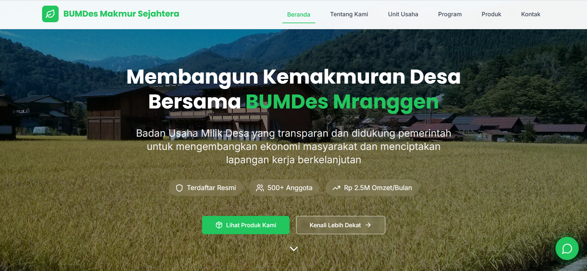

# BUMDes Mranggen - Official Landing Page



This is the official responsive landing page for **BUMDes (Badan Usaha Milik Desa) Makmur Sejahtera Mranggen**. The website is designed to be a modern, professional, and informative digital presence for the organization, showcasing its mission, business units, products, and contact information to the public.

**Live Demo URL:** Under Development

---

## ✨ Key Features

- **Fully Responsive Design**: Optimized for a seamless experience on desktops, tablets, and mobile devices.
- **Interactive Sections**:
  - **Business Units**: An expandable card interface to display details, key metrics, and services for each unit (Agriculture, Tourism, UMKM, etc.).
  - **Locations**: An interactive map section allowing users to switch between different office/unit locations, view details, and get directions via Google Maps.
- **Smooth Scrolling Navigation**: A sticky header and smooth scroll-to-section functionality for easy navigation.
- **Dynamic Content**: Data for business units, locations, and links are stored in arrays, making it easy to update and maintain.
- **"Click-to-Action" Integrations**:
  - **WhatsApp Chat**: Pre-filled messages to easily contact different business units or customer service.
  - **Google Maps**: "Get Directions" buttons that open Google Maps with the destination pre-set.
- **Modern UI/UX**: Built with Tailwind CSS for a clean, utility-first design, featuring custom components, icons, and a consistent color scheme.

---

## 🛠️ Tech Stack

This project is built with a modern frontend stack:

- **[React](https://reactjs.org/)**: A JavaScript library for building user interfaces.
- **[Vite](https://vitejs.dev/)**: A next-generation frontend tooling that provides a faster and leaner development experience.
- **[Tailwind CSS](https://tailwindcss.com/)**: A utility-first CSS framework for rapid UI development.
- **[Lucide React](https://lucide.dev/)**: A beautiful and consistent icon toolkit.

---

## 🚀 Getting Started

To get a local copy up and running, follow these simple steps.

### Prerequisites

Make sure you have Node.js and npm (or yarn) installed on your machine.

- [Node.js](https://nodejs.org/en/) (v18.x or later recommended)
- `npm` or `yarn`

### Installation & Setup

1. **Clone the repository:**

   ```sh
   git clone https://github.com/erlanggsss/BumdesMranggen.git
   ```
2. **Navigate to the project directory:**

   ```sh
   cd BumdesMranggen
   ```
3. **Install NPM packages:**

   ```sh
   npm install
   ```
4. **Run the development server:**

   ```sh
   npm start
   ```

Open http://localhost:5173 (or the address shown in your terminal) with your browser to see the result.

---

## 📁 Project Structure

The project follows a standard React application structure:

```
src/
├── components/       # Shared, reusable components (AppIcon, AppImage, ui/Button)
├── pages/            # Page-level components
│   └── landing-page/ # Main landing page and its sections
├── styles/           # Global styles and Tailwind CSS configuration
├── App.jsx           # Main application component
└── index.jsx         # Entry point of the React application
```

---
